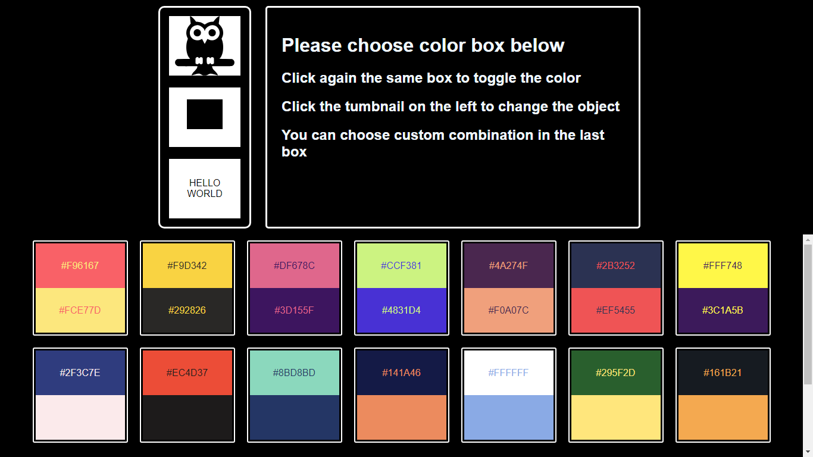
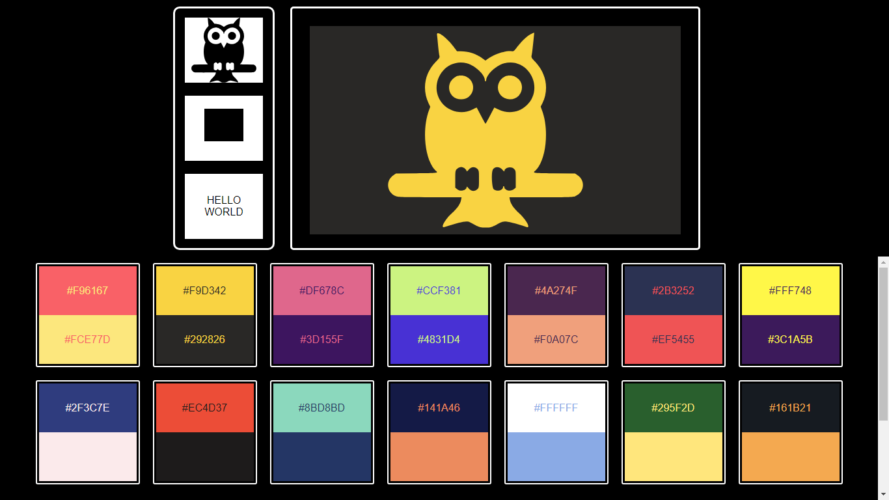
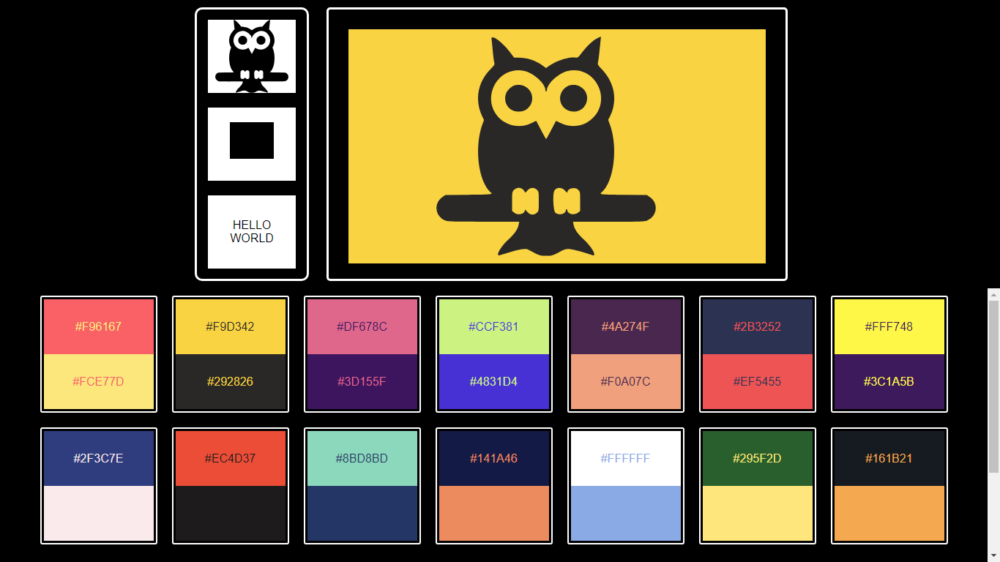
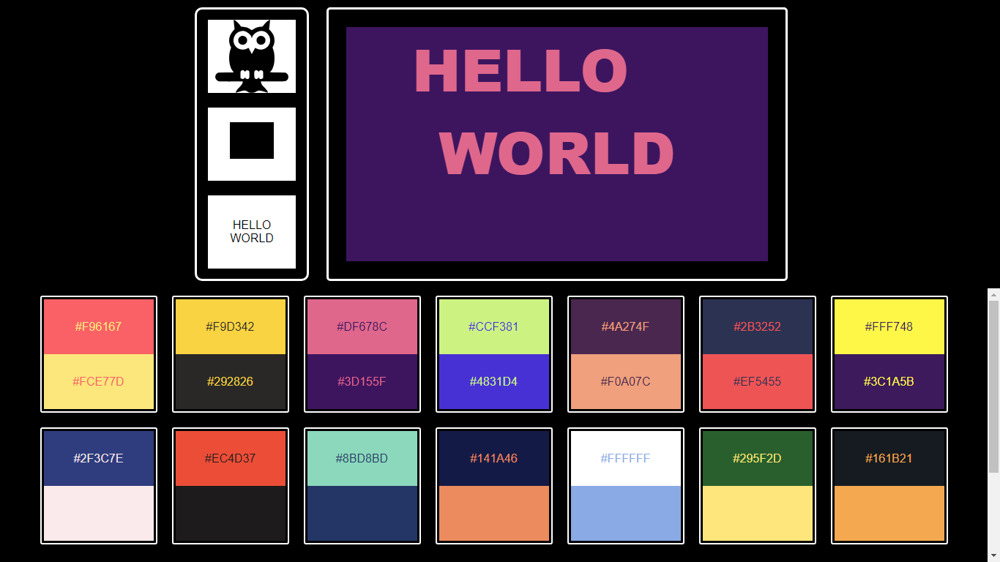
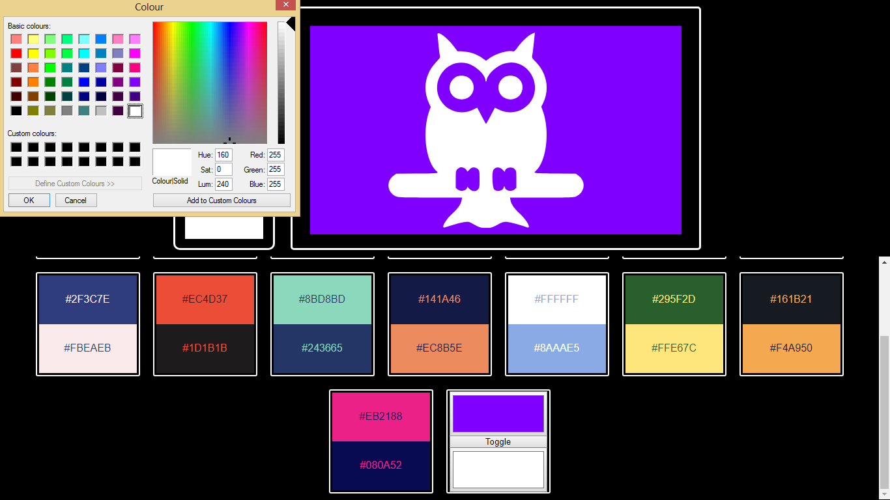

# ColorCompanion

Color companion is a angular application which allows the user to choose and apply different color combination for a object such that it can be used to decide best suited color comibationn for logos , website , e.t.c.

#Requirements

- Node with angular cli installed

#Running the application

- Clone the project
- In CLI enter npm install
- Run ng serve for a dev server. Navigate to http://localhost:4200/

#Screenshots

