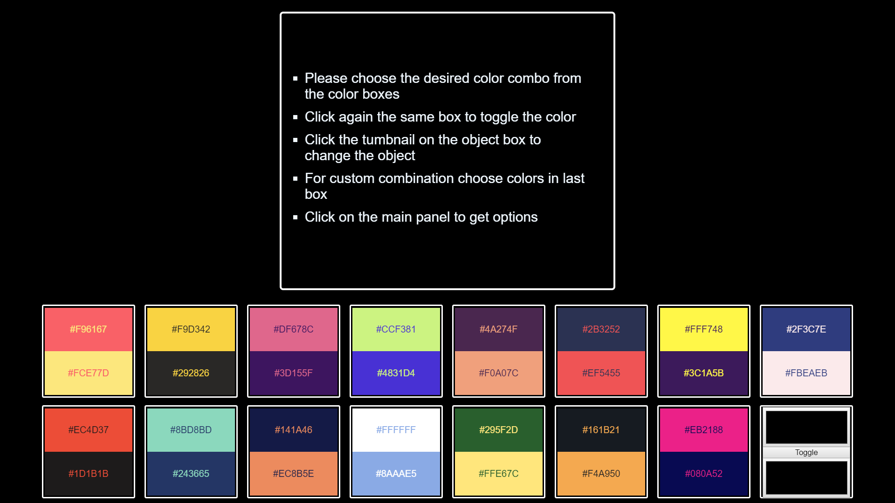
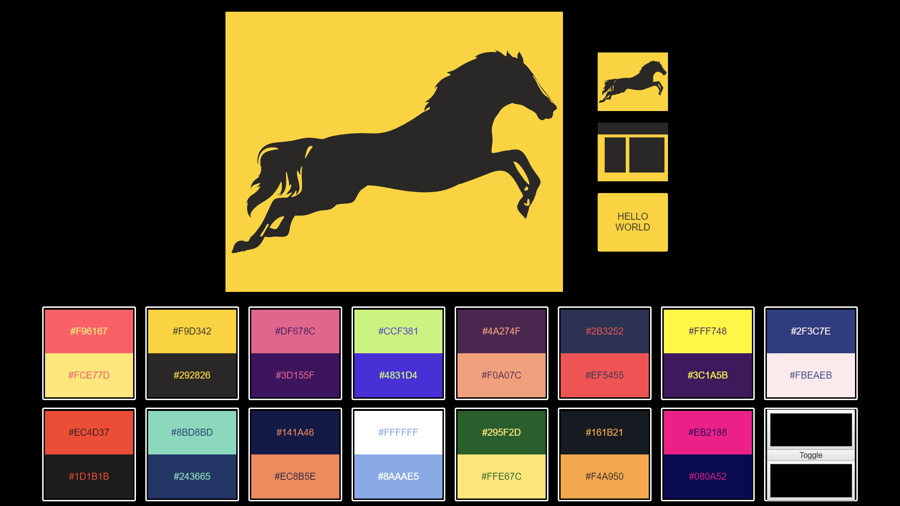
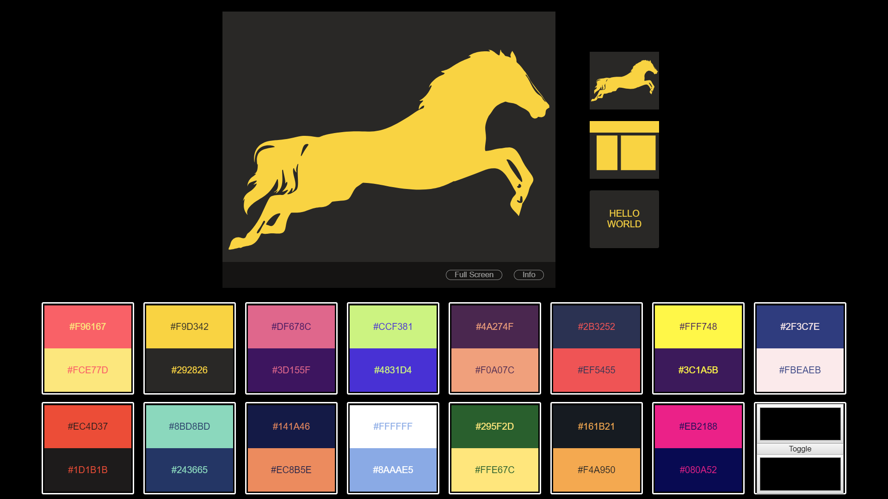
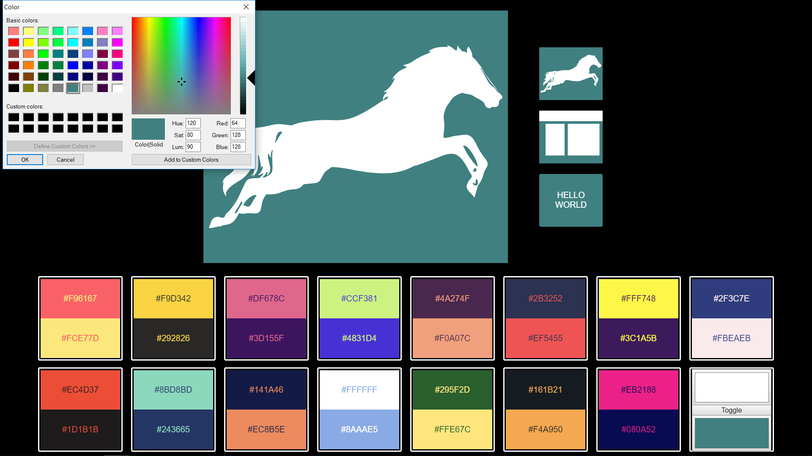
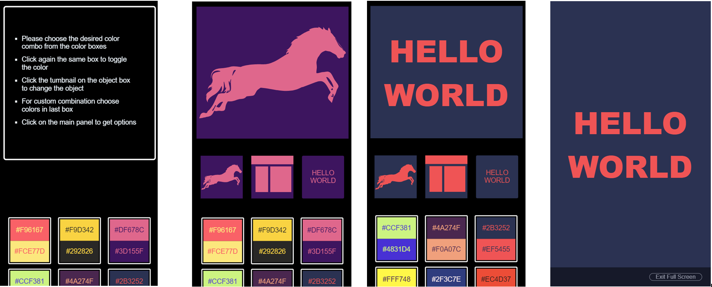

Color Companion
============================

> Color companion is a responsive web application developed using Angular framework which allows the user to choose and apply different color combination for a object such that it can be used to decide best suited color comibationn for logos , website , e.t.c. 

### Implementaion

- Color companion has two main components 
  - color-boxes-panel -> Provides the choices to choose color combination from various color combination boxes
  - screens-panel     -> Displays the object with color combo from the choice. 
- Data passing is done using service with **behavior subject**

### Requirements

- Node with angular cli installed

### Live

- https://ajayc07.github.io/colorMatcher

### Features

- Selecting and trying color combo from the available color combination
- Selecting and trying color combo with custom color choice from the pallet
- Selecting and trying with 3 different object (Image , Containers , Text)
- Viewing the selection in full screen

### Running the application in local

- Clone the project
- In CLI enter npm install
- Run ng serve for a dev server.

### Screenshots

